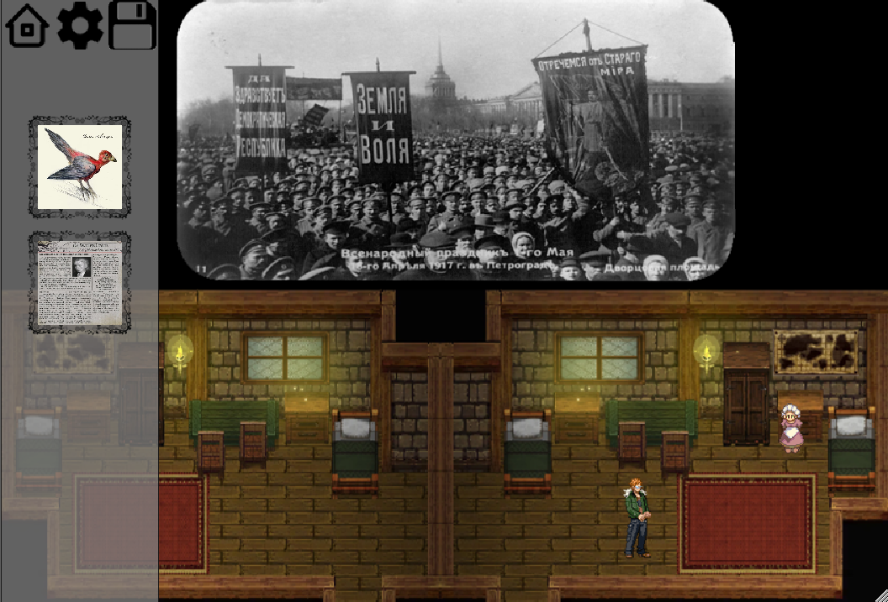
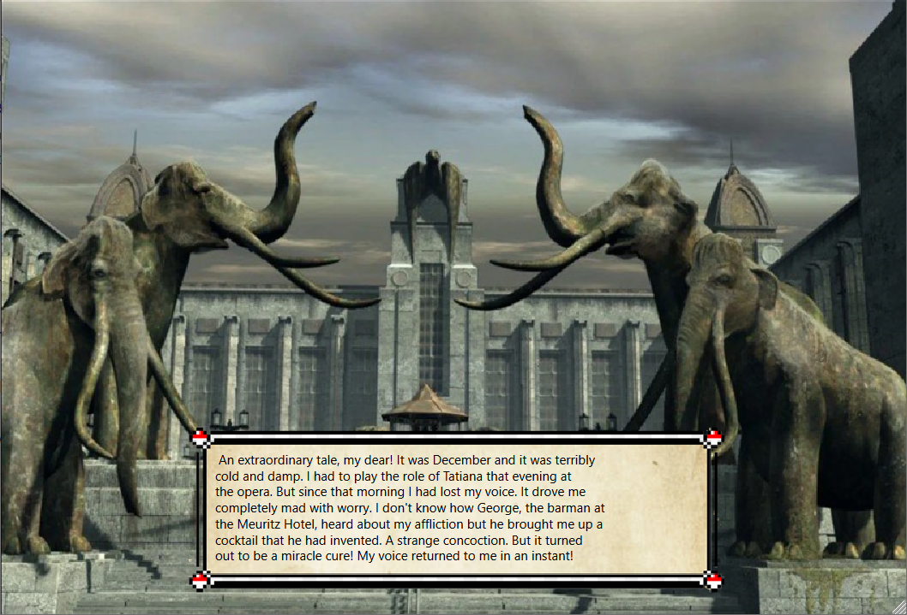

<h1 align="center">Syberia</h1>

<h2 align = "center">Summary<h2>
<h6>My game is a slight cariation of the classic Syberia 
developed by Microïds.</h6>

<h2 align="center"> Gameplay</h2>
<h6>The gameplay consists of moving between locations, 
searching for active points on the screen and solving puzzles.
Management is carried out using the keyboard. When hovering 
over an active point, the cursor changes shape depending on 
what the character can do: go to another location, take an 
item, talk to the character, etc.</h6>

<h2 align="center"> Instalation</h2>
<h6>To run this application, download the GitHub releases
<a href = "https://github.com/Lenson423/Syberia/releases/tag/tmp">rar</a>.</h6>

<h2 align="center">Contributing</h2>
<h6><a href = "https://github.com/yandex/CMICOT/blob/master/CPP_STYLE_GUIDE.md">Code style</a> 
<a href = "https://github.com/Lenson423">Author</a></h6>
